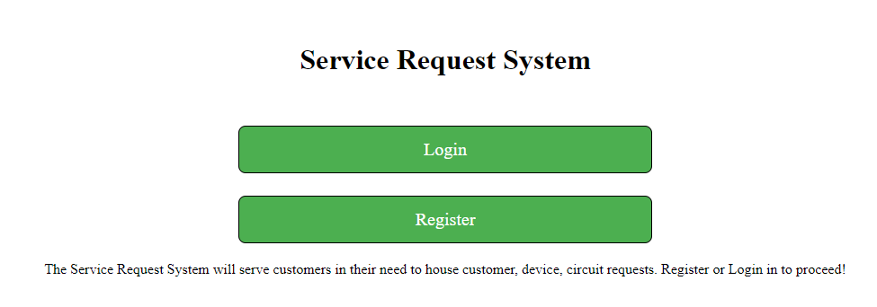

<h1>Project Description</h1>

This project is focused on being able to create Telecom customer records. This system would allow us to enter in devices the customer
uses on both ends of a circuit and house information regarding services that ride each one circuit. This allows the ISP to house a front end for their customers to submit their service requests.

 Link to heroku live app <a href="https://pure-oasis-55665.herokuapp.com/">here</a>

<h2> Technologies used</h2>
<ul>
<li>HTML</li>
<li>Javascript/Jquery</li>
<li>CSS</li>
<li>Node.js/Express</li>
</ul>

<h2>Example of usage work flow</h2>

First register or log into system via main page

Next you can either create individual devices and customers via their own pages, or create 1 request that pools the information and submits all at once.
Follow the links on the header to each of these pages

 Schema object dependancies as follows to create a Service Request object

<ul>
<li>Service Request</li>
<ul>
<li>Service Record</li>
<ul><li>Circuit Record</li>
<ul><li>2 devices to assign to A and Z location</li></ul>
<li>Customer Record</li>
</ul>
</ul>

 Ensure that each record has the required information, and you can then use 'My' Records pagse to pull up request records 

